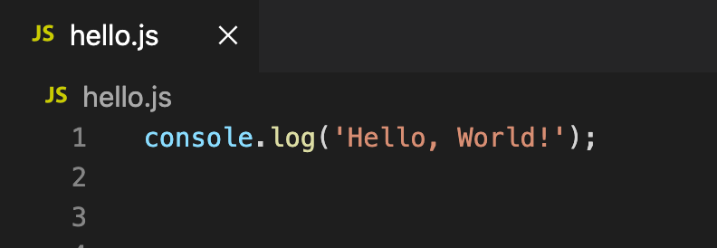
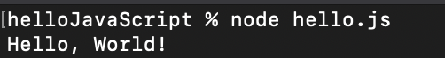
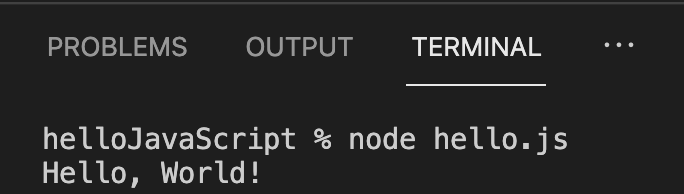
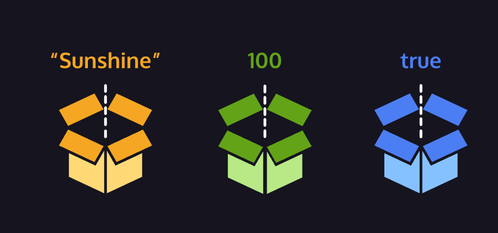

# 02 – JavaScript Basics — Lesson 2

> **Main point:** These notes collect the core JavaScript fundamentals from your `Full Stack | Js interactive websites` file into one place: syntax, data types, operators, variables, and conditional logic.
>
> **Code blocks:** Fences use **triple tildes** (e.g. `~~~jsx`, `~~~text`, `~~~html`, `~~~css` … `~~~`) instead of triple backticks if the backtick key is awkward. For short snippets, many Markdown previews also accept HTML: `<pre><code class="language-js">…</code></pre>`.

## 02 – JavaScript Basics — Chapter 2 — 03/23/2026

*Use **Main notes** for explanations and code examples; use **Vocab** and **Important notes** when you review.*

---

## Main notes

### Introduction to JavaScript & ES6

JavaScript is a flexible, powerful language used in both the **browser (front‑end)** and on the **server (back‑end)** via environments like Node.js. It is standardized as **ECMAScript (ES)** and frequently updated with new features.

#### Key ideas

- JavaScript runs in all modern browsers and can also run on servers (Node.js).
- It works alongside **HTML** (structure) and **CSS** (styling) to create **interactive** web pages.
- ES6 (also called “modern JavaScript”) introduced:
  - `let` and `const` for variables
  - Arrow functions
  - Classes
  - Default parameters
  - Promises and other async tools

#### Try it: Hello World with Node.js

When you run JavaScript outside the browser, you typically create a `.js` file and execute it with **Node.js**. For example, a file `hello.js` containing `console.log('Hello, World!');` can be run from a terminal as `node hello.js`.

The same command works in the integrated terminal in VS Code (or another editor):

---

### Data Types

JavaScript has **eight fundamental data types**:

- **Number** – any numeric value, including decimals: `4`, `3.14`, `2025`.
- **BigInt** – very large integers, written with `n`: `1234567890123456n`.
- **String** – text wrapped in quotes: `"Hello"`, `'World'`.
- **Boolean** – logical values: `true` or `false`.
- **Null** – intentional absence of a value: `null`.
- **Undefined** – declared but not assigned: `let x; // x is undefined`.
- **Symbol** – unique identifiers (used in advanced patterns).
- **Object** – collections of related data and behavior.

The first seven are **primitive types**; **objects** are more complex structures.

---

### Arithmetic Operators

An **operator** is a character (or characters) that performs an action on values.

Common **arithmetic operators**:

1. Addition: `+`
2. Subtraction: `-`
3. Multiplication: `*`
4. Division: `/`
5. Remainder: `%`

~~~jsx
console.log(3 + 4);   // 7
console.log(5 - 1);   // 4
console.log(4 * 2);   // 8
console.log(9 / 3);   // 3

console.log(3.5 + 28);   // 31.5
console.log(2025 - 1969); // 56
console.log(65 / 240);   // 0.270833...
console.log(0.2708 * 100); // 27.08
~~~

When you use `console.log(...)`, JavaScript **evaluates** the expression inside the parentheses and logs the result.

---

### Strings & Concatenation

You can **append** strings using the `+` operator.

~~~jsx
console.log("Hello" + "World");      // "HelloWorld"
console.log("Hello" + " " + "World"); // "Hello World"
~~~

**Concatenation** – joining multiple strings together with `+`.

#### Template literals (ES6)

Use **backticks** and `${}` for cleaner string interpolation:

~~~jsx
const name = "Owen";
const city = "Cork City";

console.log(`My name is ${name}. My favourite city is ${city}.`);
// "My name is Owen. My favourite city is Cork City."
~~~

Template literals make it much easier to embed values and expressions inside strings.

---

### Properties & Methods

When you create a value in JavaScript, the engine wraps it in an object so it can expose **properties** and **methods**.

- A **property** is information stored on a value.
- A **method** is a function stored on an object that performs an action.

You access them with **dot notation**:

~~~jsx
console.log("Hello".length);   // 5  (string length property)
console.log("hello".toUpperCase()); // "HELLO"
console.log("Hey".startsWith("H")); // true
~~~

#### Vocabulary

- **Property** – a named value (`key: value`) associated with an object, e.g. `length`.
- **Method** – a function stored on an object, e.g. `toUpperCase()`.
- **Prototype** – the object that other objects inherit methods and properties from.

---

### Built‑in Objects

JavaScript provides many **built‑in objects** you can use immediately:

- `Math` – math utilities
- `Date` – dates and times
- `JSON` – JSON parsing and stringifying

Example with `Math`:

~~~jsx
console.log(Math.random());           // random number between 0 (inclusive) and 1 (exclusive)
console.log(Math.random() * 50);      // random number between 0 and 50
console.log(Math.floor(Math.random() * 50)); // random integer between 0 and 49
~~~

- `Math.random()` – returns a random decimal in \[0, 1).
- `Math.floor()` – rounds a number **down** to the nearest integer.

---

### Variables & Declarations

A **variable** is a named container for a value stored in memory.

Variables let you:

1. **Create** them with a descriptive name.
2. **Store / update** information.
3. **Reference** (read) the stored value later.

#### `var`, `let`, and `const`

~~~jsx
var oldWay = "Pre‑ES6";      // function‑scoped, avoid in modern code
let count = 1;               // block‑scoped, can be reassigned
const pi = 3.14159;          // block‑scoped, cannot be reassigned
~~~

- **`var`** – function‑scoped, hoisted; can be redeclared. Generally avoid.
- **`let`** – block‑scoped; can be reassigned but not redeclared in the same scope.
- **`const`** – block‑scoped; **must** be assigned once and cannot be reassigned.

~~~jsx
let meal = "Enchiladas";
console.log(meal); // "Enchiladas"
meal = "Burrito";
console.log(meal); // "Burrito"

let price;
console.log(price); // undefined
price = 350;
console.log(price); // 350

const myName = "Gilberto";
console.log(myName); // "Gilberto"
// myName = "Other"; // ❌ TypeError: Assignment to constant variable.
~~~

---

### Assignment & Update Operators

#### Mathematical assignment

~~~jsx
let levelUp = 10;
let powerLevel = 9001;
let multiplyMe = 32;
let quarterMe = 1152;

levelUp += 5;     // 15
powerLevel -= 100; // 8901
multiplyMe *= 11; // 352
quarterMe /= 4;   // 288
~~~

#### Increment and decrement

~~~jsx
let a = 10;
a++;              // 11

let b = 5;
b--;              // 4
~~~

- `++` – increases a numeric variable by 1.
- `--` – decreases a numeric variable by 1.

---

### String Concatenation with Variables & Interpolation

Concatenating variables:

~~~jsx
let myPet = "armadillo";
console.log("I own a pet " + myPet + "."); 
// "I own a pet armadillo."
~~~

Using **template literals** for interpolation:

~~~jsx
const pet = "armadillo";
console.log(`I own a pet ${pet}.`);
// "I own a pet armadillo."
~~~

Interpolation is almost always **cleaner and safer** than building strings with repeated `+`.

---

### The `typeof` Operator

`typeof` returns the **data type** (as a string) of a value:

~~~jsx
const unknown1 = "foo";
console.log(typeof unknown1); // "string"

const unknown2 = 10;
console.log(typeof unknown2); // "number"

const unknown3 = true;
console.log(typeof unknown3); // "boolean"

let newVariable = "Playing around with typeof.";
console.log(typeof newVariable); // "string"

newVariable = 1;
console.log(typeof newVariable); // "number"
~~~

---

### Conditional Statements

Conditional statements let your program make **decisions**.

#### `if` and `if…else`

~~~jsx
let sale = true;

if (sale === true) {
  console.log("Time to buy!");
}

sale = false;

if (sale) {
  console.log("Time to buy!");
} else {
  console.log("Time to wait for a sale.");
}
~~~

#### Comparison operators

- `<`, `>`, `<=`, `>=`
- `===` – strict equality (same value **and** type)
- `!==` – strict inequality

~~~jsx
10 < 12;               // true
"apples" === "oranges"; // false

let hungerLevel = 7;

if (hungerLevel > 7) {
  console.log("Time to eat!");
} else {
  console.log("We can eat later!");
}
~~~

---

### Logical Operators

Used with booleans to build more complex conditions:

- **AND** – `&&` – both sides must be `true`
- **OR** – `||` – at least one side must be `true`
- **NOT** – `!` – flips `true` ↔ `false`

~~~jsx
if (stopLight === "green" && pedestrians === 0) {
  console.log("Go!");
} else {
  console.log("Stop");
}

if (day === "Saturday" || day === "Sunday") {
  console.log("Enjoy the weekend!");
} else {
  console.log("Do some work.");
}

let excited = true;
console.log(!excited); // false
~~~

---

### Truthy & Falsy Values

In conditionals, non‑boolean values are **coerced** to `true` or `false`.

**Falsy values**:

- `0`
- `""` or `''` (empty strings)
- `null`
- `undefined`
- `NaN`

Everything else is **truthy**.

~~~jsx
let myVariable = "I exist!";

if (myVariable) {
  console.log(myVariable);
} else {
  console.log("The variable does not exist.");
}

let numberOfApples = 0;

if (numberOfApples) {
  console.log("Let us eat apples!");
} else {
  console.log("No apples left!");
}
// "No apples left!"
~~~

#### Truthy / falsy assignment shortcut

~~~jsx
let username = "";
let defaultName = username || "Stranger";

console.log(defaultName); // "Stranger"
~~~

`a || b` returns `a` if it’s truthy; otherwise it returns `b`.

---

### Ternary Operator

The **ternary operator** is a compact `if…else`.

~~~jsx
let isNightTime = true;

// Long form
if (isNightTime) {
  console.log("Turn on the lights!");
} else {
  console.log("Turn off the lights!");
}

// Ternary
isNightTime
  ? console.log("Turn on the lights!")
  : console.log("Turn off the lights!");
~~~

Syntax:

~~~txt
condition ? expressionIfTrue : expressionIfFalse
~~~

---

### `else if` and `switch`

Use `else if` when you have **multiple** conditions:

~~~jsx
let stopLight = "yellow";

if (stopLight === "red") {
  console.log("Stop!");
} else if (stopLight === "yellow") {
  console.log("Slow down.");
} else if (stopLight === "green") {
  console.log("Go!");
} else {
  console.log("Caution, unknown!");
}
~~~

Use `switch` when you are checking **one value against many options**:

~~~jsx
let groceryItem = "papaya";

switch (groceryItem) {
  case "tomato":
    console.log("Tomatoes are $0.49");
    break;
  case "lime":
    console.log("Limes are $1.49");
    break;
  case "papaya":
    console.log("Papayas are $1.29");
    break;
  default:
    console.log("Invalid item");
    break;
}
// "Papayas are $1.29"
~~~

Always include `break` (or `return`) in each `case` to avoid **fall‑through**.

---

## Vocab

- **Lesson focus:** 02 – JavaScript Basics.
- **ECMAScript / ES6** – the standardized language; “modern JS” often means ES6+ features.
- **Primitive types** – `number`, `bigint`, `string`, `boolean`, `null`, `undefined`, `symbol`.
- **`let` / `const`** – block-scoped variables; prefer `const` unless you must reassign.
- **Template literals** – backtick strings with `${}` interpolation.
- **Operator** – symbol that performs an operation on values (`+`, `===`, `&&`, etc.).
- **Truthy / falsy** – values that coerce to true/false in boolean contexts.
- **Conditional** – `if` / `else if` / `else`, `switch`, ternary `? :`.

---

## Important notes

> **Questions:** Write important questions you have in a box like this.

- Prefer **`const`** by default; use **`let`** when you need to reassign.
- Use **`===`** and **`!==`** unless you explicitly want coercion.
- **Template literals** are usually clearer than string concatenation.

---

## Chapter 2 summary

When you review your notes, briefly summarize what you learned and what is important to retain from the full page of notes. That helps you internalize the information.

- JavaScript uses **standard data types** (numbers, strings, booleans, etc.) plus complex **objects**.
- You use **variables** (`let`, `const`) to store and reuse values.
- **Operators** (`+`, `-`, `*`, `/`, `%`, `+=`, `++`, etc.) let you compute new values quickly.
- **Strings** can be built with `+` or, better, with **template literals** and `${}`.
- **Properties** and **methods** are accessed via **dot notation**, e.g. `"Hi".length`, `"Hi".toUpperCase()`.
- **Built‑in objects** like `Math` provide useful utilities.
- **Conditionals** (`if`, `else if`, `else`, `switch`) and **logical operators** (`&&`, `||`, `!`) control program flow.
- **Truthy/falsy** values and the **ternary operator** (`condition ? a : b`) give you powerful shorthand patterns.
