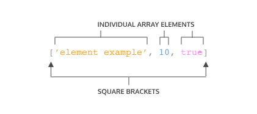
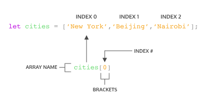
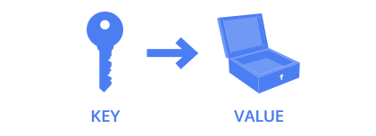
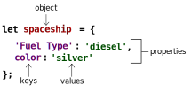
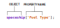
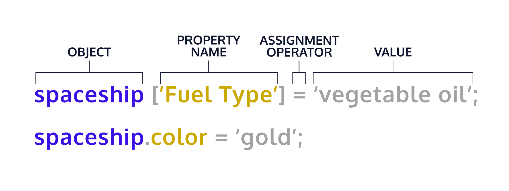

# 04 – Arrays, Loops, and Objects — Lesson 4

> **Main point:** These notes reorganize your array and loop content from `Full Stack | Js interactive websites` into one coherent module, including a concise **objects** section with diagrams.
>
> **Code blocks:** Fences use **triple tildes** (e.g. `~~~jsx`, `~~~text`, `~~~html`, `~~~css` … `~~~`) instead of triple backticks if the backtick key is awkward. For short snippets, many Markdown previews also accept HTML: `<pre><code class="language-js">…</code></pre>`.

## 04 – Arrays, Loops, and Objects — Chapter 4 — 03/23/2026

*Use **Main notes** for explanations and code examples; use **Vocab** and **Important notes** when you review.*

---

## Main notes


### Arrays – Basics

An **array** is an ordered list of values, written with square brackets `[]`.

~~~jsx
const mixedArray = ["Owen", 42, true];
~~~



- The array is everything inside the `[]`.
- Each item is an **element**.
- Elements can be **any** type (numbers, strings, booleans, objects, other arrays, etc.).


#### Key points

- Arrays are **ordered** – the order you insert items is preserved.
- Arrays are **zero‑indexed** – the first element is at index `0`.

---

### Accessing Elements

Use **bracket notation** with an index:

~~~jsx
const cities = ["New York", "London", "Tokyo"];

console.log(cities[0]); // "New York"
console.log(cities[1]); // "London"
console.log(cities[2]); // "Tokyo"
~~~



Strings are also indexable:

~~~jsx
const hello = "Hello World";
console.log(hello[6]); // "W"
~~~

---

### Arrays with `let` and `const`

~~~jsx
let condiments = ["Ketchup", "Mustard", "Soy Sauce", "Sriracha"];
const utensils = ["Fork", "Knife", "Chopsticks", "Spork"];
~~~

- Declaring an array with **`const`** means you **cannot reassign** the variable:
  - `utensils = []` ❌
- But you **can** still **mutate** its contents:

~~~jsx
utensils[0] = "Spoon"; // ✅ allowed
~~~

- Declaring with **`let`** allows both **mutation** and **reassignment** of the variable.

---

### The `.length` Property

`.length` returns the **number of elements** in an array:

~~~jsx
const newYearsResolutions = ["Keep a journal", "Take a falconry class"];

console.log(newYearsResolutions.length); // 2
~~~

`.length` is also used heavily with loops to know when to stop.

---

### Adding and Removing Elements

#### `.push()` – add to the end

~~~jsx
const itemTracker = ["item 0", "item 1", "item 2"];

itemTracker.push("item 3", "item 4");

console.log(itemTracker);
// ["item 0", "item 1", "item 2", "item 3", "item 4"]
~~~

- `.push()` is a **mutating** (destructive) method – it changes the original array.

#### `.pop()` – remove from the end

~~~jsx
const newItemTracker = ["item 0", "item 1", "item 2"];

const removed = newItemTracker.pop();

console.log(newItemTracker); // ["item 0", "item 1"]
console.log(removed);        // "item 2"
~~~

- `.pop()` removes the **last** element and returns it.
- Also mutates the original array.

---

### Arrays & Functions

Arrays are **passed by reference**, so changes inside functions can affect the original array.

~~~jsx
const flowers = ["peony", "daffodil", "marigold"];

function addFlower(arr) {
  arr.push("lily");
}

addFlower(flowers);
console.log(flowers);
// ["peony", "daffodil", "marigold", "lily"]
~~~

Another example:

~~~jsx
const concept = ["arrays", "can", "be", "mutated"];

function changeArr(arr) {
  arr[3] = "MUTATED";
}

changeArr(concept);
console.log(concept); // ["arrays", "can", "be", "MUTATED"]

function removeElement(arr) {
  arr.pop();
}

removeElement(concept);
console.log(concept); // ["arrays", "can", "be"]
~~~

Be careful when mutating arrays inside functions – it can be powerful but also surprising if you expect data to stay unchanged.

---

### Nested Arrays

Arrays can contain other arrays – these are **nested arrays**.

~~~jsx
const nestedArr = [[1], [2, 3]];

console.log(nestedArr[1]);    // [2, 3]
console.log(nestedArr[1][0]); // 2
~~~

Chain bracket notation to access deeper levels:

- `nestedArr[1]` → the second inner array (`[2, 3]`)
- `nestedArr[1][0]` → first element of that inner array (`2`)

---

### Loops – Basics

Loops help you avoid writing the same code over and over.

#### `for` loop structure

~~~jsx
for (initialization; condition; finalExpression) {
  // code to run each time
}
~~~

Example:

~~~jsx
for (let counter = 0; counter < 4; counter++) {
  console.log(counter);
}
// 0, 1, 2, 3
~~~

Explanation:

- `let counter = 0` – start at 0.
- `counter < 4` – keep looping while this is true.
- `counter++` – increase by 1 each iteration.

Another example (5 to 10):

~~~jsx
for (let counter = 5; counter < 11; counter++) {
  console.log(counter);
}
// 5, 6, 7, 8, 9, 10

~~~
Another `for` loop example:

~~~jsx
const hobbies = ['singing', 'eating', 'quidditch', 'writing'];

for (let i = 0; i < hobbies.length; i++) {
  console.log(`I enjoy ${hobbies[i]}.`);
}
~~~

Example of a `for...of` loop:

~~~jsx
const hobbies = ['singing', 'eating', 'quidditch', 'writing'];

for (const hobby of hobbies) {
  console.log(`I enjoy ${hobby}.`);
}
~~~

Notice how the `for...of` loop has a simpler syntax, which is good for readability in larger, more complex applications.

Both examples print:

~~~text
I enjoy singing.
I enjoy eating.
I enjoy quidditch.
I enjoy writing.
~~~
---

### Looping in Reverse

Sometimes you want to loop from the **end** of an array back to the **start**.

~~~jsx
const fruits = ["apple", "banana", "cherry", "date"];

for (let i = fruits.length - 1; i >= 0; i--) {
  console.log(fruits[i]);
}
// date, cherry, banana, apple
~~~

This is especially useful when **removing items** from an array while you iterate, to avoid index issues.

### Iterating Through a string 

The `for...of` loop can also be used to iterate over strings. Here’s an example: 

~~~jsx
const username = 'joe';

for (const char of username) {
  console.log(char);
}
~~~

Which prints this in the terminal:

~~~text
j
o
e
~~~
Notice the similarities between iterating through a string and iterating through an array

---

### Looping Through Arrays

Classic `for` loop over an array:

~~~jsx
const vacationSpots = ["Bali", "Paris", "Tulum"];

for (let i = 0; i < vacationSpots.length; i++) {
  console.log("I would love to visit " + vacationSpots[i]);
}
~~~

Modern patterns (for reference):

~~~jsx
const numbers = [1, 2, 3, 4];

for (const num of numbers) {
  console.log(num * 2);
}

const doubled = numbers.map(num => num * 2);
console.log(doubled); // [2, 4, 6, 8]
~~~

---

### Nested Loops

A **nested loop** is a loop inside another loop.

Useful when comparing each element of one array with each element of another:

~~~jsx
const bobsFollowers = ["Maya", "Jake", "Zara", "Omar"];
const tinasFollowers = ["Zara", "Nina", "Omar"];
const mutualFollowers = [];

for (let i = 0; i < bobsFollowers.length; i++) {
  for (let j = 0; j < tinasFollowers.length; j++) {
    if (bobsFollowers[i] === tinasFollowers[j]) {
      mutualFollowers.push(bobsFollowers[i]);
    }
  }
}

console.log(mutualFollowers); // ["Zara", "Omar"]
~~~

> Be careful with nested loops: they can become slow for large arrays because they compare many combinations.

---

### `while` Loops

Use a `while` loop when you **don’t know** in advance how many times you’ll loop.

~~~jsx
const cards = ["diamond", "spade", "heart", "club"];
let currentCard;

while (currentCard !== "spade") {
  currentCard = cards[Math.floor(Math.random() * 4)];
  console.log(currentCard);
}
~~~

`while` loops evaluate a condition for as long as it’s true, and the looping stops when the condition becomes false.

Make sure the loop condition will eventually become false to avoid **infinite loops**.

---

### `do…while` Loops

A **do…while** loop runs its body **at least once**, then keeps going while a condition is true.

~~~jsx
let cupsOfSugarNeeded = 3;
let cupsAdded = 0;

do {
  cupsAdded++;
  console.log(cupsAdded + " cup was added");
} while (cupsAdded < cupsOfSugarNeeded);
~~~

---

### The `break` Keyword

`break` lets you exit a loop **early**.

~~~jsx
const rapperArray = ["Lil' Kim", "Jay-Z", "Notorious B.I.G.", "Tupac"];

for (let i = 0; i < rapperArray.length; i++) {
  console.log(rapperArray[i]);
  if (rapperArray[i] === "Notorious B.I.G.") {
    break;
  }
}

console.log("And if you don't know, now you know.");
~~~

Useful for:

- Searching until you find something.
- Stopping once a condition is satisfied.

### The `continue` keyword

`continue` is used to skip one iteration of a loop.

Here’s an example:

~~~jsx
const strangeBirds = ['Shoebill', 'Cockatrice', 'Basan', 'Cow', 'Terrorbird', 'Parotia', 'Kakapo'];

for (const bird of strangeBirds) {
  if (bird === 'Cow') {
    continue;
  }
  console.log(bird);
}
~~~

This will iterate through the array and print out every value except the suspected imposter:

~~~text
Shoebill
Cockatrice
Basan
Terrorbird
Parotia
Kakapo
~~~

#### Use case: reverse `for` loop

~~~jsx
const nums = [1, 2, 3];

for (let i = nums.length - 1; i >= 0; i--) {
  console.log(nums[i]);
}

console.log("Time is up!");
~~~

This prints:

~~~text
3
2
1
Time is up!
~~~

This example shows how you can iterate an array in reverse.

---

### Objects

An **object** is a **non-primitive** value that groups related data (and optionally behavior) under one variable. Unlike arrays, plain objects are **unordered**: you care about **named properties**, not numeric positions.

Objects store data as **key–value pairs**. Each **key** (also called a **property name**) labels a piece of data; the **value** can be any type (string, number, boolean, array, another object, function, etc.).



#### Why use objects?

- Model real-world things (a user, a product, a spaceship) as one structure.
- Pass a single argument into a function instead of many separate variables.
- Keep related settings or API responses in one place.

#### Object literals

The usual way to create an object is an **object literal**: curly braces `{}` with zero or more properties inside.

~~~jsx
let spaceship = {}; // empty object

let spaceship = {
  "Fuel Type": "diesel",
  color: "silver",
};
~~~

- Keys are often written **without quotes** when they are valid identifiers (`color`).
- Use **quotes** when the key has spaces or special characters (`"Fuel Type"`).

This diagram matches the same idea: the variable holds one **object**; each line inside `{}` is a **property** made of a **key** and a **value**.



#### Properties and methods

- A **property** is a key and its value together.
- If a property’s value is a **function**, that property is often called a **method** (behavior on the object).

~~~jsx
const dog = {
  name: "Rex",
  bark() {
    console.log("Woof!");
  },
};

dog.bark(); // "Woof!"
~~~

#### Accessing and updating values

**Dot notation** — clear when the key is a valid identifier:

~~~jsx
console.log(spaceship.color); // "silver"
spaceship.color = "gold";
~~~


**Bracket notation** — required for dynamic keys or non-identifier keys:

~~~js
console.log(spaceship["Fuel Type"]); // "diesel"

const key = "color";
console.log(spaceship[key]); // same as spaceship.color
~~~

Assignment works the same way: `spaceship["Fuel Type"] = "electric";`

Another example of using the dot notation in javascript

~~~js
  homePlanet: 'Earth',
  color: 'silver',
  'Fuel Type': 'Turbo Fuel',
  numCrew: 5,
  flightPath: ['Venus', 'Mars', 'Saturn']
  };

  // Write your code below
  //1. Let’s use the dot operator to access the value of numCrew from the spaceship object in the code editor. Create a variable crewCount and assign the spaceship object’s numCrew property to it.
  let crewCount = spaceship.numCrew;

  let planetArray = spaceship.flightPath;


// Again, using the dot operator, create a variable planetArray and assign the spaceship object’s flightPath property to it.
  planetArray.flightpath;
~~~

# Bracket notation 
## 3/30/2026

This is how you would use brakcet notation to access a objects property,
First you pass in the property name inside square brackets as a string.



You should use brakacet notation when accessing keys that arent valid identifier names,

```js
  let spaceship = {
    'Fuel Type': 'Turbo Fuel',
    'Active Duty': true,
    homePlanet: 'Earth',
    numCrew: 5
  };
  spaceship['Active Duty'];   // Returns true
  spaceship['Fuel Type'];   // Returns 'Turbo Fuel'
  spaceship['numCrew'];   // Returns 5
  spaceship['!!!!!!!!!!!!!!!'];   // Returns undefined
```

You can also use a variable inside the brackets to select the keys of an object is good when working with functions

```js
let returnAnyProp = (objectName, propName) => objectName[propName];
 
returnAnyProp(spaceship, 'homePlanet'); // Returns 'Earth'
```
# Property Assignment 
## 3/31/2026

Once an object is defined you arent stuck with the properties that were wrote, Objects are mutable which means you can
updated them after we created them!

You can use dot notation (.) or bracket nation ([]) with the assignment operator = to add a new key-value pair to a object or change
a current property.



One of two things can happen with a property assignment 
- if a property exists on the object which ever value it held before will be replace with a new assigned value
- if there was no property with that name, a new property will be added to the object.

! its important to know that even tho you cant reassign a object that is declared with const you can still mutate it which means
you can add new properties and change the properties that are there.

Heres an example of doing the above
```js
  const spaceship = {type: 'shuttle'};
  spaceship = {type: 'alien'}; // TypeError: Assignment to constant variable.
  spaceship.type = 'alien'; // Changes the value of the type property
  spaceship.speed = 'Mach 5'; // Creates a new key of 'speed' with a value of 'Mach 5'
```

Heres how you would use the delete operator in property assignment!
```js
const spaceship = {
  'Fuel Type': 'Turbo Fuel',
  homePlanet: 'Earth',
  mission: 'Explore the universe' 
};
 
delete spaceship.mission;  // Removes the mission property
```
# Methods
## 3/31/2026
When a function is stored as a value on an object, it’s called a method.
An object’s properties describe what it has (its data), and its methods describe what it does (its behavior).

Object methods might already feel familiar because you’ve been using them all along.
For example, console is a global JavaScript object, and log() is one of its methods.
Math is another global object, and floor() is a method on it too.

You can add methods to an object literal using regular key-value pairs.
The key becomes the method name, and the value is a function expression (often anonymous).

With ES6 method shorthand, you can define object methods without writing the colon or the function keyword.

```js
const alienShip = {
  invade: function () { 
    console.log('Hello! We have come to dominate your planet. Instead of Earth, it shall be called New Xaculon.')
  }
};
```

You call an object method by writing the object name, a dot, and then the method name with parentheses.
```js
alienShip.invade(); // Prints 'Hello! We have come to dominate your planet. Instead of Earth, it shall be called New Xaculon.'
```

# Nested Objects
## 3/31/2026
In real applications, objects are often nested.
An object can contain another object as a property, and that nested object can have a property that holds an array of more objects.

In our spaceship object, we can add a crew object to store the people who run the craft.
Each crew member can be its own object with properties like name and degree, plus role-specific methods.
We can nest other objects too, like telescope, or group computer-related details inside a parent nanoelectronics object.

```js
    const spaceship = {
      telescope: {
        yearBuilt: 2018,
        model: '91031-XLT',
        focalLength: 2032 
      },
      crew: {
        captain: { 
          name: 'Sandra', 
          degree: 'Computer Engineering', 
          encourageTeam() { console.log('We got this!') } 
        }
      },
      engine: {
        model: 'Nimbus2000'
      },
      nanoelectronics: {
        computer: {
          terabytes: 100,
          monitors: 'HD'
        },
        'back-up': {
          battery: 'Lithium',
          terabytes: 50
        }
      }
    };
```
You can chain operators to access nested properties.
At each level, choose the operator that matches the data type you’re working with.
A helpful strategy is to evaluate the expression left to right—like the computer does—so each step is smaller and easier to follow.

```js
  spaceship.nanoelectronics['back-up'].battery; // Returns 'Lithium'
```
In that code:

The computer first evaluates spaceship.nanoelectronics, which returns an object containing back-up and computer.
Next, ['back-up'] accesses the back-up object.
Then, .battery reads the battery property on that object and returns 'Lithium'.

```js
    let spaceship = {
  // Heres a kev value pair in js nested objects
  passengers: [{name: 'Space Dog'}],
  telescope: {
    yearBuilt: 2018,
    model: "91031-XLT",
    focalLength: 2032 
  },
  crew: {
    captain: { 
      name: 'Sandra', 
      degree: 'Computer Engineering', 
      encourageTeam() { console.log('We got this!') },
     'favorite foods': ['cookies', 'cakes', 'candy', 'spinach'] }
  },
  engine: {
    model: "Nimbus2000"
  },
  nanoelectronics: {
    computer: {
      terabytes: 100,
      monitors: "HD"
    },
    'back-up': {
      battery: "Lithium",
      terabytes: 50
    }
  }
};

let capFave = spaceship.crew.captain['favorite foods'][0];

let firstPassenger = spaceship.passengers[0];

```

#### Looping over objects

**`for...in`** iterates over enumerable **keys** (watch out for inherited keys on plain objects; many style guides prefer the approaches below for “own” properties only).

~~~jsx
const meal = {
  appetizer: "salad",
  main: "pasta",
  dessert: "gelato",
};

for (const key in meal) {
  console.log(`${key}: ${meal[key]}`);
}
~~~

**`Object.keys`**, **`Object.values`**, and **`Object.entries`** give arrays you can loop with `for...of`:

~~~jsx
for (const key of Object.keys(meal)) {
  console.log(key, meal[key]);
}

for (const [key, value] of Object.entries(meal)) {
  console.log(key, value);
}
~~~

#### Quick comparison: arrays vs objects

| | **Array** | **Object** |
|---|-----------|--------------|
| Order | Ordered (indices `0`, `1`, …) | Unordered (named keys) |
| Access | `arr[0]` | `obj.key` or `obj["key"]` |
| Typical use | Lists of similar items | Records, maps, things with named fields |

---

## Vocab

- **Array** – an ordered list of values inside `[]`; each item is an **element**.
- **Index** – the position of an element in the array, starting at `0` (think “first seat is seat 0”).
- **Element** – a single value or item stored in an array.
- **Zero-indexed** – the first element is at index `0`.
- **`.length`** – number of elements in an array; often used as a loop bound.
- **`.push()` / `.pop()`** – add to / remove from the **end** of an array (both **mutate** the array).
- **Mutating (destructive) method** – changes the original array in place.
- **Pass by reference** – arrays given to functions refer to the same array; mutations inside the function affect the original.
- **Nested array** – an array that contains other arrays; access with chained `[i][j]` notation.
- **`for` loop** – `for (init; condition; after) { }` repeats while the condition is true.
- **`for...of`** – loop over **values** of an iterable (arrays, strings, etc.).
- **`for...in`** – loop over **keys** of an object (watch inherited keys; prefer `Object.keys` / `Object.entries` for “own” properties when needed).
- **`while` / `do…while`** – repeat while a condition is true; `do…while` runs the body at least once.
- **`break` / `continue`** – exit the loop early / skip the rest of the current iteration.
- **Nested loop** – a loop inside another loop (e.g. compare every element of one array with every element of another).
- **Object** – a non-primitive value grouping **key–value** **properties**; plain objects are **unordered** (named properties, not numeric positions).
- **Property** – a key and its value together on an object.
- **Method** – a property whose value is a **function** (behavior on the object).
- **Object literal** – ` { } ` with zero or more `key: value` pairs.
- **Dot notation** – `obj.key` when the key is a valid identifier.
- **Bracket notation** – `obj["key"]` or `obj[variable]` for dynamic or non-identifier keys.
- **`Object.keys` / `Object.values` / `Object.entries`** – produce arrays you can loop with `for...of`.

---

## Important notes

> **Questions:** Write important questions you have in a box like this.

- Arrays are **ordered** and **zero‑indexed**; strings can be iterated character by character with `for...of`.
- **`const`** arrays cannot be **reassigned**, but their **contents** can still be **mutated** (e.g. index assignment, `push`, `pop`).
- Prefer **reverse `for` loops** when removing items while iterating to avoid index bugs.
- **`while`** loops need a condition that eventually becomes **false** to avoid **infinite loops**.
- **`break`** stops the whole loop; **`continue`** skips to the **next iteration**.
- **Nested loops** can get slow on large data (many comparisons).
- **Objects** model “things” with named fields; choose **arrays** for ordered lists and **objects** for records / maps.

---

## Chapter 4 summary

When you review your notes, briefly summarize what you learned and what is important to retain from the full page of notes. That helps you internalize the information.

- **Arrays** store ordered lists of values and are zero‑indexed.
- Use `.length`, `.push()`, `.pop()`, and bracket notation `[]` to work with array data.
- Arrays are **mutable** and passed by **reference**, so functions can change them.
- **Nested arrays** let you build more complex data structures.
- **Loops** (`for`, `while`, `do…while`, nested loops) let you repeat actions efficiently.
- `break` lets you exit a loop early once a condition is met; `continue` skips the rest of one iteration.
- **Objects** group data as **key–value** **properties**; use **`{}`** for literals.
- Read and update properties with **dot notation** or **bracket notation**; loop with **`for...in`** or **`Object.keys` / `Object.entries`**.
